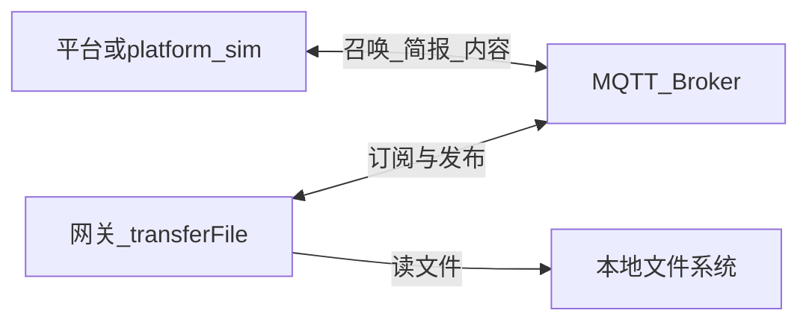
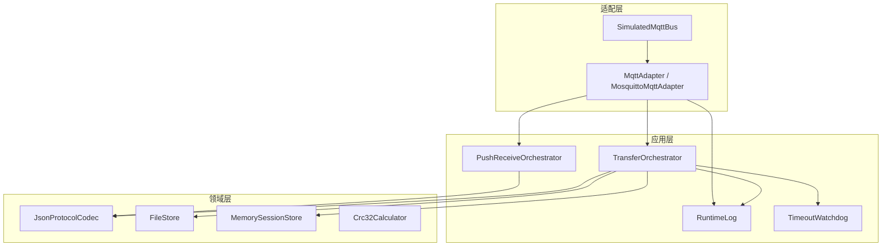
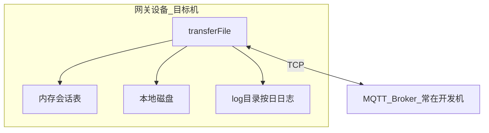

# 02 — 系统架构

## 1. 文档目的

描述网关侧文件传输功能的逻辑架构、模块职责、部署视图及模块间依赖。与当前 C++ 源码布局一致。

## 2. 系统上下文

- **网关**为本项目核心交付物（`transferFile`）。
- **平台**为外部环境；联调时使用开发机 `platform_sim` 或真实平台。
- **Broker** 常用 mosquitto；开发机可运行系统服务，目标机通过 IP 连接同一 Broker。

## 3. 逻辑分层架构

### 3.1 分层原则

| 层次 | 职责 | 依赖方向 |
|------|------|----------|
| 适配层 | MQTT 连接、订阅召唤、发布简报/内容；或内存模拟总线 | 依赖应用层回调与配置 |
| 应用层 | 会话状态机、超时、运行日志 | 依赖领域层 |
| 领域层 | 编解码、文件读取、会话存储、CRC | 不依赖 MQTT 库 |

## 4. 模块说明

| 模块 | 源码位置 | 职责 |
|------|----------|------|
| **MosquittoMqttAdapter** | `src/mqtt/mosquitto_mqtt_adapter.cpp` | 真实 MQTT：连接、订阅、发布 |
| **SimulatedMqttAdapter** | `src/mqtt/mqtt_adapter.cpp` | 内存总线，无 Broker |
| **TransferOrchestrator** | `src/app/transfer_orchestrator.cpp` | R1–R5 召唤上传；V0.0.4 逐段确认 |
| **PushReceiveOrchestrator** | `src/app/push_receive_orchestrator.cpp` | P1–P4 平台推送至网关 |
| **RuntimeLog** | `src/app/runtime_log.cpp` | 结构化日志：控制台 + 按日文件 |
| **JsonProtocolCodec** | `src/protocol/json_codec.cpp` | JSON 编解码 |
| **FileStore** | `src/storage/file_store.cpp` | 路径校验、读文件 |
| **MemorySessionStore** | `src/session/memory_session_store.cpp` | 内存会话表 |
| **TimeoutWatchdog** | `src/app/timeout_watchdog.cpp` | 180s 超时 |
| **ConfigLoader** | `src/config/config_loader.cpp` | 加载 JSON 配置 |

## 5. 部署视图

| 项 | 说明 |
|----|------|
| 进程模型 | 单实例；`transferFile` 前台或集成方守护 |
| 状态持久化 | 仅内存；重启后依赖平台重召唤续传 |
| 日志持久化 | 运行目录下 `log/YYYY-MM-DD.log`（自动创建） |
| 外部依赖 | libmosquitto（可选模拟）、POSIX 文件 IO |
| 交叉编译 | OpenWrt aarch64，见 07 章 |

## 6. 数据流概要

1. **入站（召唤）**：召唤 → `onSummon`；内容确认 → `onContentConfirm`（V0.0.4）。
2. **出站（召唤成功）**：简报 → 内容段 → 等待确认 → 下一段，直至文件尾。
3. **入站（推送）**：推送简报/内容 → `PushReceiveOrchestrator`；出站推送确认。
4. **出站（召唤失败）**：仅简报失败，无内容。

## 7. 与需求的关系

| 需求 | 主要承担模块 |
|------|----------------|
| R1 | MqttAdapter + ProtocolCodec + Orchestrator |
| R2、R3 | Orchestrator |
| R4 | TimeoutWatchdog + Orchestrator |
| R5 | Orchestrator + SessionStore + FileStore |

## 8. 技术选型（已定）

| 类别 | 选择 |
|------|------|
| MQTT 客户端 | **libmosquitto**（主机动态库 / 交叉编译 bundled） |
| 单元测试 | GoogleTest（可选）或 `tests/minimal_test` |
| 日志 | **RuntimeLog**（见 [11-运行日志.md](11-运行日志.md)） |
| 构建 | CMake 3.14+，C++17 |

## 9. 安全与约束

- 仅允许读取 `allowedPathRoots` 下文件，禁止 `..` 穿越。
- MQTT 鉴权与 TLS：配置字段预留，V0.0.1 未启用。
- 日志不打印 Content 载荷全文，仅元数据与路径摘要。

## 10. 扩展点（后续版本）

- 多会话并发队列
- 会话持久化
- 传输速率限制与背压
- 可配置日志目录与级别
