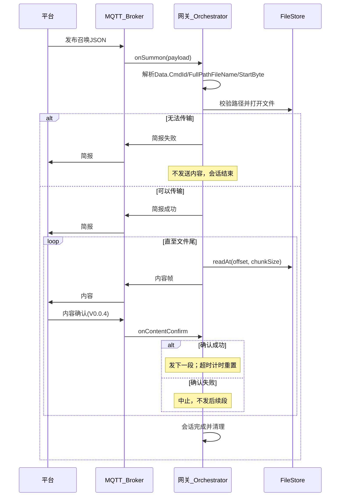
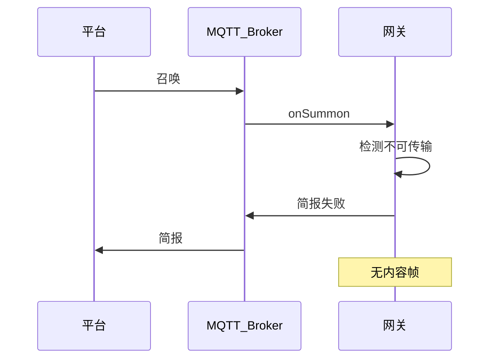
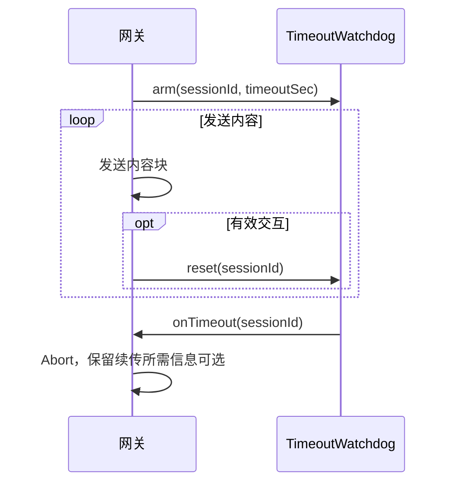
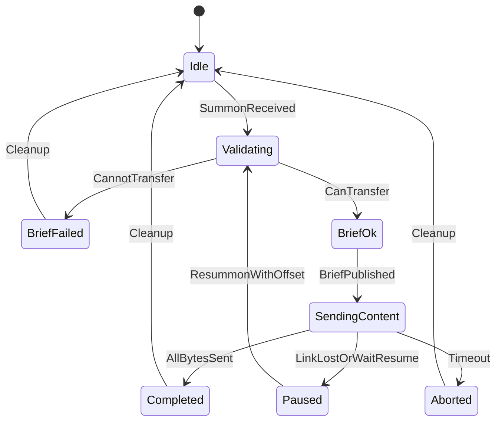

# 03 — 业务流程与状态机

## 1. 文档目的

定义网关侧文件传输的正常流程、异常流程、状态机迁移及超时规则，作为 `TransferOrchestrator` 实现的直接依据。

## 2. 正常业务流程

### 2.1 步骤说明

| 步骤 | 动作 | 需求 |
|------|------|------|
| 1 | 接收召唤 | R1 |
| 2 | 校验帧、会话、偏移 | R1、R5 |
| 3 | 访问文件，决定可否传输 | R3 |
| 4 | 发送简报（成功或失败） | R2、R3 |
| 5 | 仅简报成功时循环发送内容 | R2 |
| 6 | 发送完毕或超时后清理会话 | R4 |

## 3. 失败业务流程（R3）

以下情况**仅**发送简报失败，**禁止**发送任何内容帧：

| 场景 | 建议错误语义 | 状态迁移 |
|------|--------------|----------|
| 文件不存在 | FILE_NOT_FOUND | Validating → BriefFailed → 终止 |
| 无读权限 | PERMISSION_DENIED | 同上 |
| 路径非法（穿越、越出根目录） | INVALID_PATH | 同上 |
| 偏移大于文件大小 | INVALID_OFFSET | 同上 |
| 已有活跃会话且策略为拒绝新召唤 | BUSY | 同上 |
| JSON 无效或必填字段缺失 | BAD_FRAME | 简报 Status=1 |
| 磁盘读错误 | IO_ERROR | 简报失败后终止 |

## 4. 超时中止流程（R4）

### 4.1 规则

- 默认超时：**180 秒**（`timeoutSec`）。
- **计时器启动**：会话进入 `Validating` 或从 Idle 接受召唤时。
- **计时器重置**（有效交互）：
  - 收到**平台文件内容确认**（V0.0.4，成功或失败均重置，见 [04-通信协议.md](04-通信协议.md) §8）；
  - 收到**新的合法召唤**（含续传，含新的 `StartByte`）。
- **不重置**：仅发送简报/内容段而未收到对应内容确认时（等待确认期间计时继续）。
- **计时器触发**：Orchestrator 将状态置为 `Aborted`，停止内容发送，关闭文件句柄，从 SessionStore 移除或标记会话结束。

### 4.2 超时后会话数据

| 策略 | 说明 | V0.0.1 建议 |
|------|------|-------------|
| 清除会话 | 平台必须带全量 fileId + offset 冷续传 | 进程重启时采用 |
| 保留 Paused 会话 | 平台可用原 sessionId 续传 | 单进程内超时前发送过部分数据时，可保留至 `Paused` 供 06 章使用 |

**V0.0.1 约定**：超时进入 `Aborted` 后，若需续传由平台**重新召唤**并提供 offset；是否保留 sessionId 映射见 [06-断点续传设计.md](06-断点续传设计.md)。

## 5. 状态机定义

### 5.1 状态枚举

| 状态 | 含义 |
|------|------|
| `Idle` | 无活跃传输，等待召唤 |
| `Validating` | 已收召唤，校验参数并访问文件 |
| `BriefFailed` | 已发简报失败，即将清理 |
| `BriefOk` | 简报成功已发送，准备发内容 |
| `SendingContent` | 正在按块发送内容 |
| `WaitingContentConfirm` | 已发一段内容，等待平台内容确认（V0.0.4） |
| `Paused` | 已发送部分数据后暂停（链路断、等待续传召唤，可选） |
| `Completed` | 全部字节已发送 |
| `Aborted` | 超时或内部错误导致中止 |

### 5.2 状态迁移图

### 5.3 迁移表

| 当前状态 | 事件 | 条件 | 下一状态 | 副作用 |
|----------|------|------|----------|--------|
| Idle | SummonReceived | 无其他活跃会话或策略允许 | Validating | 创建/加载会话，arm 计时器 |
| Idle | SummonReceived | 已有活跃会话且拒绝 | BriefFailed | 发简报 BUSY |
| Validating | CannotTransfer | — | BriefFailed | 发简报失败，关闭文件 |
| Validating | CanTransfer | — | BriefOk | 发简报成功 |
| BriefOk | BriefPublished | — | SendingContent | 发首块内容 |
| SendingContent | AllBytesSent | offset >= fileSize | Completed | 清理 |
| SendingContent | Timeout | — | Aborted | 停止发送，清理 |
| SendingContent | ResummonWithOffset | 平台新召唤 | Validating | 更新 offset，见 06 章 |
| Paused | ResummonWithOffset | 校验通过 | Validating | 从 offset 继续 |
| BriefFailed / Completed / Aborted | Cleanup | — | Idle | 移除会话 |

## 6. 并发与排队策略

V0.0.1 **推荐策略**：若当前状态非 `Idle` 且非针对同一会话的续传召唤，则对新召唤回复简报失败（`BUSY`），不排队。

**备选**（后续版本）：FIFO 队列缓存召唤。当前设计文档不采用。

## 7. 与 R2 的顺序约束（实现检查点）

在 `SendingContent` 之前，必须满足：

1. 已调用 `encodeBrief` 且 `publishBrief` 成功（或失败分支仅 Brief）；
2. 状态机未处于 `BriefFailed`；
3. 单元测试通过 Hook 验证「内容发布调用序 late于简报」。

## 8. 平台侧时序（protocol-1.0）

| 约定 | 说明 |
|------|------|
| 先简报后内容 | `Status="0"` 后再发内容 JSON |
| 内容分段 | `FileSegNo` 从 1 递增，`Content` 为 Base64，`Continue` 末段为 `"0"` |
| 内容确认（V0.0.4） | 每段内容后平台发 `content_confirm`；成功后再发下一段 |
| 续传 | 中断后平台重召唤并增大 `StartByte` |
| StartByte | 1-based，续传时平台指定下一段起始字节位置 |

## 9. 运行日志（可观测性）

关键状态迁移与 MQTT 事件通过 `RuntimeLog` 输出，详见 [11-运行日志.md](11-运行日志.md) 第 6 节消息对照表。
