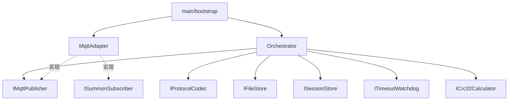

# 05 — 模块与接口设计

## 1. 文档目的

描述各模块边界、核心数据结构及依赖关系；头文件位于 `include/transfer/`。JSON 字段定义以 [04-通信协议.md](04-通信协议.md)（protocol-1.0 + ack + push）为准。

## 2. 依赖关系



- 应用层（Orchestrator）只依赖**接口**，不依赖具体 MQTT 库。
- `ProtocolCodec` 负责 JSON 与 DTO 互转；`ICrc32Calculator` 实现 04 章 CRC32（reflected, 0xEDB88320）。

## 3. 公共数据结构（领域 DTO）

与 JSON `Data` 字段对应；内部使用数值类型，编解码时与 string 互转。

### 3.1 SummonRequest（召唤解码结果）

| 字段 | 类型 | JSON 来源 | 说明 |
|------|------|-----------|------|
| cmdId | uint32_t | Data/CmdId | 命令 ID |
| fullPathFileName | string | Data/FullPathFileName | 文件全路径 |
| startByte | uint64_t | Data/StartByte | **1-based**，协议原值 |
| fileOffset | uint64_t | 派生 | **0-based**，`startByte - 1`，供 FileStore 使用 |
| rawValid | bool | — | 解码是否成功 |

### 3.2 BriefResponse（简报编码输入）

| 字段 | 类型 | JSON 目标 | 说明 |
|------|------|-----------|------|
| cmdId | uint32_t | Data/CmdId | |
| status | enum | Data/Status | `Success=0` → `"0"`，`Failure=1` → `"1"` |
| errorCode | string | Data/ErrorCode | 失败时必填 |
| note | string | Data/Note | 可选 |
| fileCrc | string | Data/FileCrc | 成功时，如 `"0xCBF43926"` |
| fileSize | uint64_t | Data/FileSize | 成功时，编码为十进制 string |
| modifyTime | string | Data/ModifyTime | 成功时，`YYYY-MM-DD HH:MM:SS` |

### 3.3 ContentSegment（内容编码输入）

| 字段 | 类型 | JSON 目标 | 说明 |
|------|------|-----------|------|
| cmdId | uint32_t | Data/CmdId | |
| fileSegNo | uint32_t | Data/FileSegNo | **从 1 开始** |
| contentRaw | vector<uint8_t> | — | 原始字节，编码时 Base64 → Content |
| continueFlag | bool | Data/Continue | `true`→`"1"`，`false`→`"0"` |

### 3.4 SessionRecord（会话存储）

| 字段 | 类型 | 说明 |
|------|------|------|
| cmdId | uint32_t | 与协议 CmdId 一致，作会话主键 |
| fullPathFileName | string | |
| fileSize | uint64_t | |
| nextFileOffset | uint64_t | 下一待发字节，**0-based** |
| nextSegNo | uint32_t | 下一内容段序号，从 1 起 |
| fileCrc | string | 简报时计算的 CRC，用于续传校验 |
| modifyTime | string | 简报时的文件修改时间 |
| state | SessionState | 与 03 章状态机对应 |
| lastActivity | time_point | 最近活动时间 |
| awaitingConfirmSegNo | uint32_t | V0.0.4：已发、待确认段号；0 表示无待确认 |

### 3.5 ContentConfirmRequest（V0.0.4，平台 → 网关）

| 字段 | 类型 | JSON 来源 | 说明 |
|------|------|-----------|------|
| cmdId | uint32_t | Data/CmdId | |
| fileSegNo | uint32_t | Data/FileSegNo | 须与已发段一致 |
| status | enum | Data/Status | `0` 成功，`1` 失败 |
| errorCode / note | string | 可选 | 失败时 |

### 3.6 TransferConfig

| 字段 | 类型 | 默认值 |
|------|------|--------|
| timeoutSec | uint32_t | 180 |
| chunkSize | uint32_t | 4096（可配置） |
| allowedPathRoots | vector<string> | 配置项，如 `/tmp/`、`/data/transfer/` |
| mqtt | MqttConfig | 见 `mqtt_config.hpp` / `config/*.json` |

## 4. 接口定义（伪代码）

### 4.1 IProtocolCodec

```cpp
class IProtocolCodec {
public:
    virtual ~IProtocolCodec() = default;

    // 解析召唤 JSON
    virtual bool decodeSummon(std::string_view jsonUtf8,
                              SummonRequest& out,
                              std::string& errorDetail) = 0;

    // 编码简报与内容 JSON
    virtual std::string encodeBrief(const BriefResponse& brief) = 0;
    virtual std::string encodeContent(const ContentSegment& seg) = 0;

    // V0.0.4：解析平台内容确认
    virtual bool decodeContentConfirm(std::string_view jsonUtf8,
                                      ContentConfirmRequest& out,
                                      std::string& errorDetail) = 0;
};
```

### 4.2 ICrc32Calculator

```cpp
class ICrc32Calculator {
public:
    virtual ~ICrc32Calculator() = default;
    // 对整个文件计算 CRC32（reflected, poly 0xEDB88320）
    virtual uint32_t computeFile(const std::string& path) = 0;
    virtual std::string toHexString(uint32_t crc) = 0;  // 如 "0x12345678"
};
```

### 4.3 IFileStore

```cpp
enum class FileOpenError {
    Ok, NotFound, PermissionDenied, InvalidPath, IoError
};

class IFileStore {
public:
    virtual ~IFileStore() = default;

    // 校验 FullPathFileName 是否在 allowedPathRoots 内
    virtual FileOpenError validatePath(const std::string& fullPath) const = 0;

    virtual FileOpenError openReadOnly(const std::string& fullPath,
                                       FileHandle& out) = 0;
    virtual FileOpenError getSize(const FileHandle& handle,
                                  uint64_t& outSize) const = 0;
    virtual FileOpenError getModifyTime(const FileHandle& handle,
                                        std::string& outTime) const = 0;
    virtual FileOpenError readAt(const FileHandle& handle,
                                 uint64_t offset,
                                 std::span<uint8_t> buffer,
                                 size_t& outRead) = 0;
    virtual void close(FileHandle& handle) = 0;
};
```

### 4.4 ISessionStore

```cpp
class ISessionStore {
public:
    virtual ~ISessionStore() = default;
    virtual std::optional<SessionRecord> getByCmdId(uint32_t cmdId) const = 0;
    virtual void upsert(const SessionRecord& record) = 0;
    virtual void remove(uint32_t cmdId) = 0;
    virtual bool hasActiveSessionOtherThan(uint32_t cmdId) const = 0;
};
```

### 4.5 ITimeoutWatchdog、IMqttPublisher

（与初版设计相同，会话键改为 `uint32_t cmdId`。）

```cpp
class ITimeoutWatchdog {
public:
    virtual void arm(uint32_t cmdId, uint32_t timeoutSec) = 0;
    virtual void reset(uint32_t cmdId) = 0;
    virtual void disarm(uint32_t cmdId) = 0;
    virtual void setCallback(std::function<void(uint32_t)> cb) = 0;
};

class IMqttPublisher {
public:
    virtual bool publishBrief(std::string_view jsonUtf8) = 0;
    virtual bool publishContent(std::string_view jsonUtf8) = 0;
};
```

### 4.6 TransferOrchestrator

```cpp
class TransferOrchestrator {
public:
    void onSummon(std::string_view jsonUtf8);
    void onContentConfirm(std::string_view jsonUtf8);  // V0.0.4
    void onTimeout(uint32_t cmdId);

private:
    void handleSummon(const SummonRequest& req);
    void sendNextSegment(SessionRecord& session);  // 逐段发送，等待确认后再发下一段
};
```

## 5. 模块与文件映射（当前实现）

| 接口/类 | 路径 |
|---------|------|
| JsonProtocolCodec | `src/protocol/json_codec.cpp` |
| Crc32Calculator | `src/protocol/crc32.cpp` |
| Base64 | `src/protocol/base64.cpp` |
| TransferOrchestrator | `src/app/transfer_orchestrator.cpp` |
| PushReceiveOrchestrator | `src/app/push_receive_orchestrator.cpp` |
| JsonPushCodec | `src/protocol/json_push_codec.cpp` |
| RuntimeLog | `src/app/runtime_log.cpp`，`include/transfer/runtime_log.hpp` |
| FileStore | `src/storage/file_store.cpp` |
| MemorySessionStore | `src/session/memory_session_store.cpp` |
| MosquittoMqttAdapter | `src/mqtt/mosquitto_mqtt_adapter.cpp` |
| SimulatedMqttAdapter | `src/mqtt/mqtt_adapter.cpp` |
| ConfigLoader | `src/config/config_loader.cpp` |
| main | `src/main.cpp` |
| platform_sim | `src/tools/platform_sim_main.cpp`（仅主机构建） |

## 6. 错误处理原则

- JSON 解析失败 → 简报 `Status="1"`, `ErrorCode="BAD_FRAME"`（若能解析出 CmdId 则回填）。
- `StartByte` 非法 → `INVALID_START_BYTE`。
- 路径不在允许根目录下 → `INVALID_PATH`。
- `publishBrief` / `publishContent` 失败 → 记录日志，会话 `Aborted`。

## 7. 日志与可观测性（RuntimeLog）

运行日志由 `RuntimeLog` 模块提供，实现文件 `src/app/runtime_log.cpp`。

**完整说明（格式、落盘、API、联调排查、消息对照表）见 [11-运行日志.md](11-运行日志.md)。**

摘要：

- 格式：`[时间] [src/...:行] [LEVEL] 消息`
- 落盘：`log/YYYY-MM-DD.log`（与控制台同步）
- API：`transfer::log::gatewayInfo` / `gatewayWarn` / `gatewayError` / `platformInfo`

## 8. 测试向量（见 08 章）

- 召唤/简报/内容 JSON 样例见 [04-通信协议.md](04-通信协议.md) 各节示例。
- CRC32 标准向量校验 `ICrc32Calculator`。
- Base64 往返测试 `Content` 字段。
