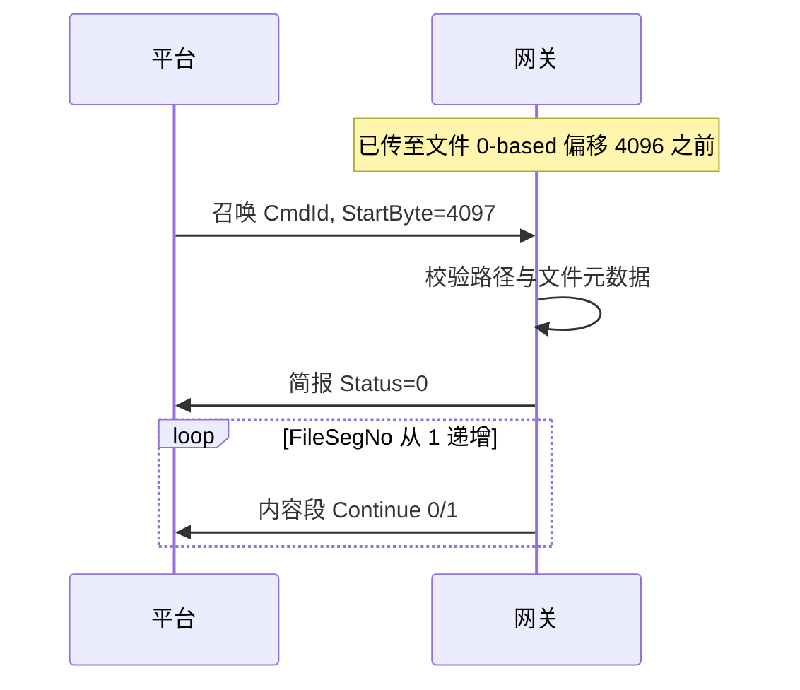

# 06 — 断点续传设计

## 1. 文档目的

定义**平台再次下发召唤**场景下的断点续传行为（V0.0.1 起实现，V0.0.2 起具备自动化验收，见 [12-V0.0.2-验收说明.md](12-V0.0.2-验收说明.md)）。续传参数来自召唤 JSON 的 **`CmdId` + `FullPathFileName` + `StartByte`（1-based）**，网关**不主动**发起续传。

协议字段详见 [04-通信协议.md](04-通信协议.md)。

## 2. 基本原则

| 原则 | 说明 |
|------|------|
| 发起方 | 仅平台通过「召唤文件」触发续传 |
| 命令关联 | 同一传输命令使用相同 **`CmdId`**；`FileSegNo` 在每次新召唤触发的发送序列中从 1 重新计数 |
| 续传起点 | 平台在召唤中设置 **`StartByte`**（1-based），表示本次应从文件的第几个字节开始传 |
| 数据重复 | **不重复**发送 `StartByte` 之前的字节；内容段从该偏移顺序读到文件尾 |
| 简报 | 续传仍须先简报后内容（R2）；成功时 `FileSize`、`FileCrc`、`ModifyTime` 须与当前文件一致 |

## 3. 偏移换算

| 概念 | 约定 |
|------|------|
| 协议 `StartByte` | 1-based，文件第一个字节为 `1` |
| 网关 `fileOffset` | 0-based，`fileOffset = StartByte - 1` |
| 合法范围 | `1 <= StartByte <= fileSize + 1`；若 `StartByte == fileSize + 1` 表示已无数据可传，简报成功后可不发内容或发 0 段（实现时与平台约定，**建议**简报成功且内容段数为 0） |

## 4. 场景分类

### 4.1 首次传输

| 项 | 值 |
|----|-----|
| StartByte | `"1"` |
| 网关行为 | 创建以 `CmdId` 为键的会话，打开 `FullPathFileName`，简报成功，从偏移 0 分段发送，`FileSegNo` 从 1 递增 |

### 4.2 同进程内中断后续传

**触发**：超时（R4）、传输未完成、平台主动重召。

平台将 **`StartByte` 设为「下一块要传的第一个字节的 1-based 位置」**。例：已完整接收 4096 字节，则续传 `StartByte="4097"`。

### 4.3 进程重启后冷续传

| 项 | 说明 |
|----|------|
| 会话表 | 内存清空，无历史 `nextFileOffset` |
| 平台 | 使用相同或新 `CmdId` + 相同 `FullPathFileName` + `StartByte` |
| 网关 | 按路径重新打开文件；简报重新计算 `FileCrc`、`FileSize`、`ModifyTime`；与平台保存的元数据比对策略由平台负责，网关可选检测 `FILE_CHANGED` |

## 5. 校验规则

| 步骤 | 检查 | 失败简报 Status | ErrorCode 示例 |
|------|------|-----------------|----------------|
| 1 | JSON 合法且必填字段存在 | 1 | BAD_FRAME |
| 2 | CmdId 在 0～4294967295 | 1 | INVALID_CMD_ID |
| 3 | StartByte 为正整数且 fileOffset ≤ fileSize | 1 | INVALID_START_BYTE |
| 4 | 路径合法且文件可读 | 1 | FILE_NOT_FOUND 等 |
| 5 | 另有活跃传输且 CmdId 不同 | 1 | BUSY |
| 6 | 续传：文件大小/CRC/ModifyTime 与平台预期不一致（可选） | 1 | FILE_CHANGED |

### 5.1 StartByte 与已发送进度

- 平台 **`StartByte` 为权威**；网关不从内容段反推平台进度。
- 若 `StartByte` 小于网关记录的 `nextFileOffset + 1`（平台要求重传已发区间）：**允许**从 `StartByte` 重新发送（可能重复），与 04 章分段逻辑一致。
- 若 `StartByte` 对应 `fileOffset > fileSize`：简报失败 `INVALID_START_BYTE`。

## 6. FileSegNo 与 Continue

每次**新的召唤**（含续传召唤）触发一次「发送序列」：

| 项 | 规则 |
|----|------|
| FileSegNo | 本次序列内从 `"1"` 递增，与历史序列无关 |
| Continue | 末段 `"0"`，其余 `"1"` |
| 与 StartByte | 第一段读取位置 = `StartByte - 1`（0-based） |

## 7. 会话生命周期

| 状态 | SessionStore（按 CmdId） |
|------|--------------------------|
| 传输中 | 记录 `nextFileOffset`、`nextSegNo` |
| Completed | 全部字节已发送且末段 `Continue=0` 后 remove |
| Aborted（超时） | remove；平台靠新召唤 + StartByte 续传 |

## 8. 与简报的协作（续传）

1. 打开 `FullPathFileName`，计算 CRC32、大小、修改时间。
2. 简报 `Status="0"`，字段填满（见 04 章）。
3. 从 `fileOffset = StartByte - 1` 开始发内容，直至文件尾。

## 9. 开放项

| 编号 | 问题 | 当前约定 |
|------|------|----------|
| O1 | 续传是否必须相同 CmdId | **建议相同**；若平台换新 CmdId 视为新命令，FileSegNo 从 1 开始 |
| O2 | StartByte = fileSize+1 | 建议简报成功、0 个内容段 |
| O3 | 平台错误码枚举 | 以平台表为准，网关 `ErrorCode` 字符串与之对齐 |

## 10. 测试要点

- 传到 50% 后 `StartByte` 续传，首段 Content 解码后对应正确文件偏移。
- `StartByte=1` 全量重传与 `StartByte` 续传不混用 CmdId 时的 BUSY 行为。
- 文件删除后续传：简报失败，无内容段。

自动化：`tests/unit/test_orchestrator.cpp`；联调见 [10-MQTT本机联调.md](10-MQTT本机联调.md)。
