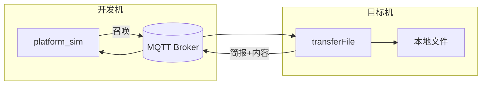

# 10 — MQTT 联调（开发机平台 + 目标机网关）

## 部署角色

| 机器 | 跑什么 | 说明 |
|------|--------|------|
| **开发机** | `platform_sim`、可选 **Broker** | 模拟平台：发召唤、收简报/内容 |
| **目标机** | `transferFile` | 真实网关：读**目标机本地文件**并上传 |
| **Broker** | mosquitto | 两边均能访问（常在开发机） |



**重要**：召唤 JSON 的 `FullPathFileName` 是 **目标机路径**。`--demo` 仅在网关也在本机时适用；目标机联调用 `--gateway-file` 或 `--publish`。

## 1. 环境与编译

```bash
# 开发机
sudo apt install mosquitto mosquitto-clients libmosquitto-dev
./scripts/build-native.sh          # platform_sim + 本机网关（可选）

# 目标机产物
./scripts/build-openwrt.sh       # build-openwrt/transferFile
```

## 2. Broker

### 2.1 系统已安装 mosquitto（Ubuntu 常见）

`apt install mosquitto` 后服务可能**已在监听 1883**，无需再执行 `mosquitto -v`（否则会 `Address already in use`）。

```bash
systemctl status mosquitto
# 本机连接测试
mosquitto_sub -h 127.0.0.1 -t '#' -v
```

目标机访问开发机 Broker 时，需 mosquitto 监听 `0.0.0.0` 或开发机 IP，并放行防火墙。

### 2.2 前台调试 Broker

```bash
sudo systemctl stop mosquitto
mosquitto -v
# 结束后: sudo systemctl start mosquitto
```

## 3. 配置文件

| 文件 | 使用方 | brokerHost 示例 |
|------|--------|-------------------|
| `config/transferFile.platform.json` | platform_sim | `127.0.0.1` |
| `config/transferFile.gateway.target.json` | 目标机 transferFile | 开发机 IP，如 `192.168.1.100` |
| `config/transferFile.mqtt-debug.json` | 本机网关+平台冒烟 | 均为 `127.0.0.1` |

`gatewayId` **两边必须相同**。

## 4. 目标机联调步骤

### 4.1 目标机：启动网关

```bash
./transferFile -c transferFile.gateway.target.json
```

### 4.2 目标机：准备文件

```bash
echo "test from target" > /tmp/platform_test_file.bin
# 路径须在 allowedPathRoots 内
```

### 4.3 开发机：平台发召唤

```bash
./build/platform_sim -c config/transferFile.platform.json \
  --gateway-file /tmp/platform_test_file.bin
```

或：

```bash
./build/platform_sim -c config/transferFile.platform.json \
  --publish '{"Data":{"CmdId":"8001","FullPathFileName":"/tmp/platform_test_file.bin","StartByte":"1"}}'
```

## 5. 本机冒烟（三终端）

```bash
./scripts/debug-mqtt-local.sh   # 打印命令摘要

# 终端 A：确认 Broker（通常无需启动）
# 终端 B：
./build/transferFile -c config/transferFile.mqtt-debug.json
# 终端 C：
./build/platform_sim -c config/transferFile.mqtt-debug.json --demo
```

## 6. platform_sim 参数

| 参数 | 说明 |
|------|------|
| `--demo` | 本机网关联调：在开发机创建 `/tmp/platform_test_file.bin` |
| `--gateway-file <路径>` | 目标机联调：路径为**目标机已有文件** |
| `--publish '<json>'` | 自定义召唤 |
| `-f summon.json` | 从文件读召唤 |
| `--listen-only` | 只收应答 |

## 7. 预期日志

运行日志格式、文件路径及阶段对照表见 **[11-运行日志.md](11-运行日志.md)**。

联调时可在目标机执行：

```bash
tail -f log/$(date +%Y-%m-%d).log
```

简要期望：网关出现 `MQTT 已连接` → `收到召唤` → `简报成功` → `传输完成`；平台出现 `已发布召唤` → `联调成功`。

## 8. 常见问题

| 现象 | 原因 |
|------|------|
| `mosquitto -v` 端口占用 | 系统服务已运行，直接用即可 |
| 平台收不到应答 | 网关未启动、gatewayId 不一致、brokerHost 错误 |
| 简报 FILE_NOT_FOUND | 文件不在**目标机**或不在 allowedPathRoots |
| `--demo` 目标机无反应 | demo 只创建开发机文件；改用 `--gateway-file` |
| 交叉编译链接 filesystem 失败 | 已改用 POSIX，请拉最新代码重编 |

## 9. 交叉编译与部署

```bash
./scripts/build-openwrt.sh
# 拷贝 build-openwrt/transferFile、配置、必要时 libmosquitto.so*
```

详见 [07-构建与交叉编译.md](07-构建与交叉编译.md)。
