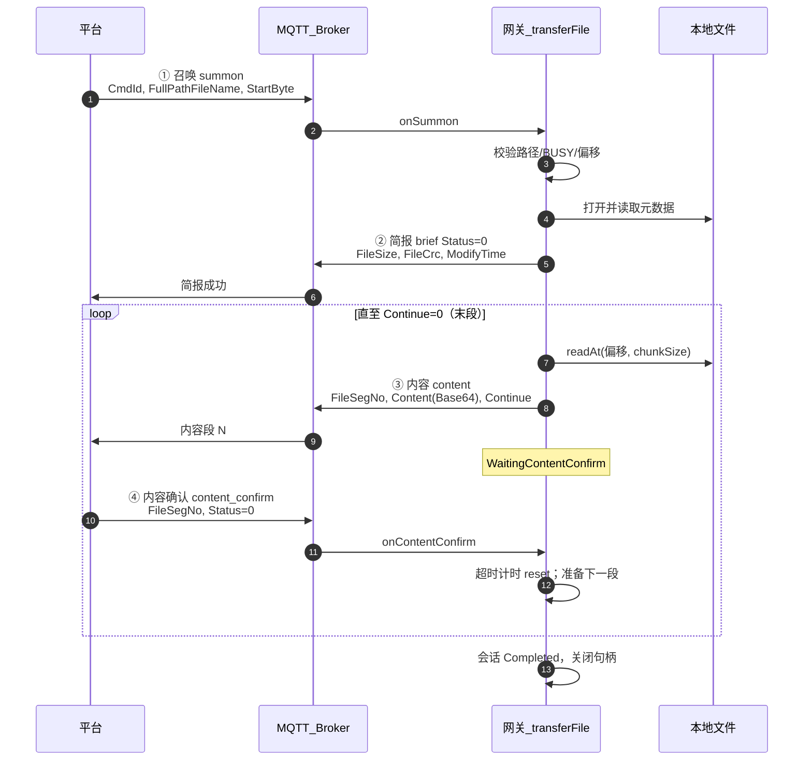
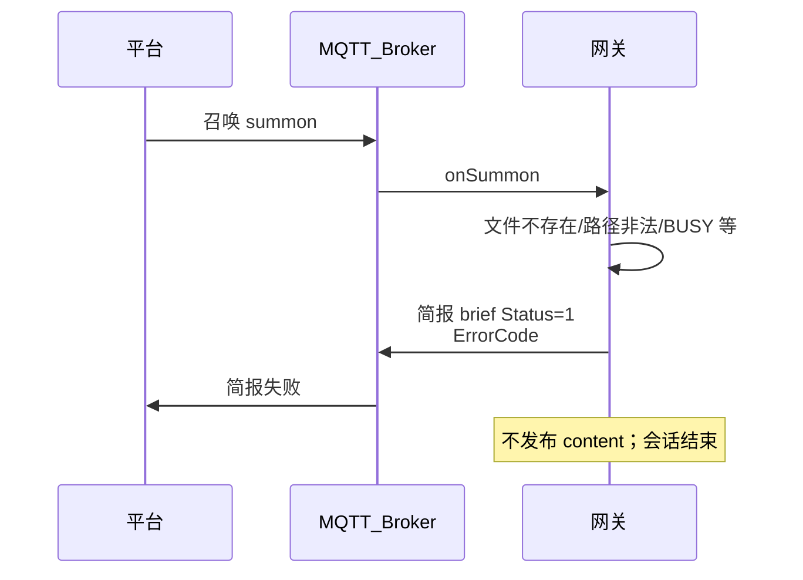
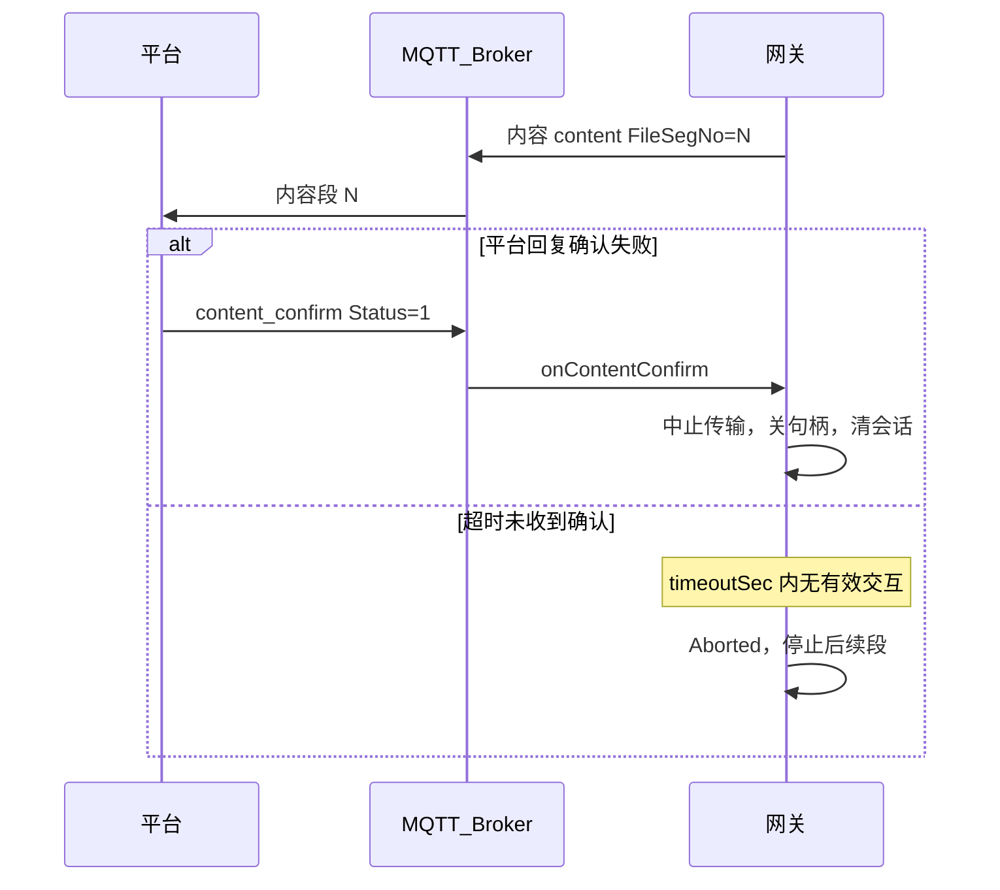
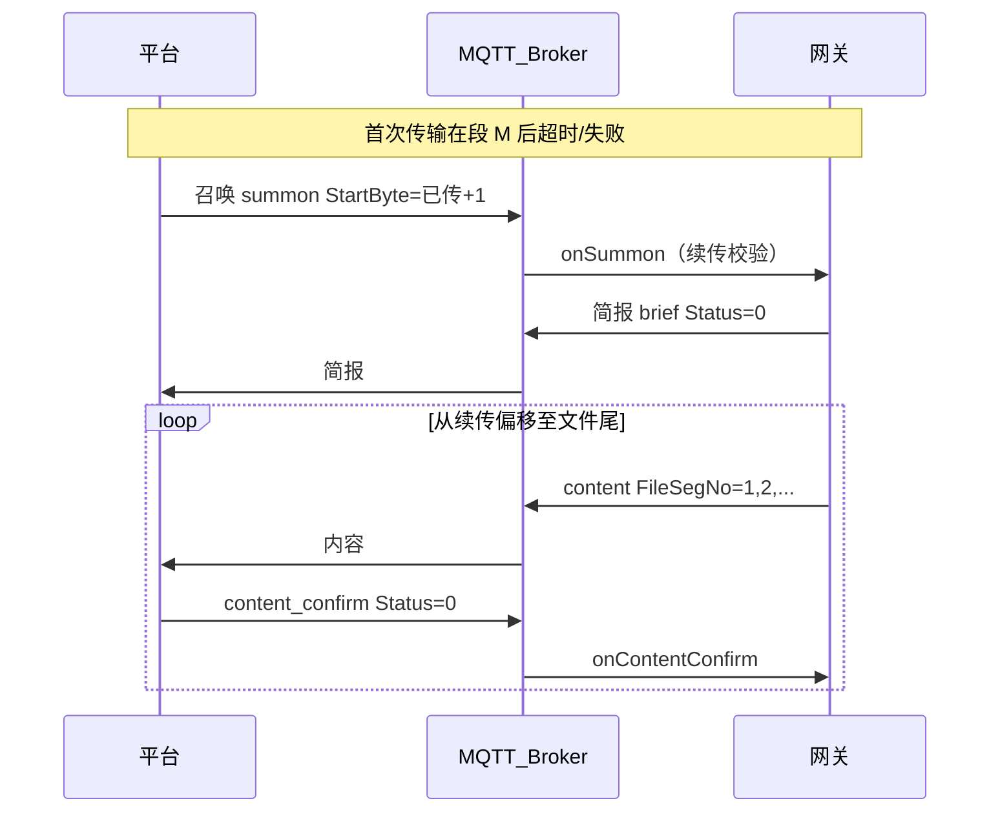
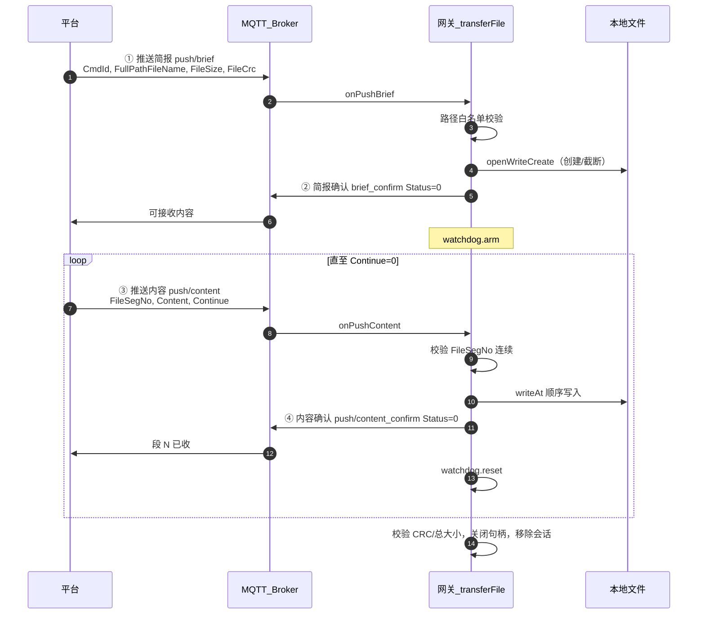
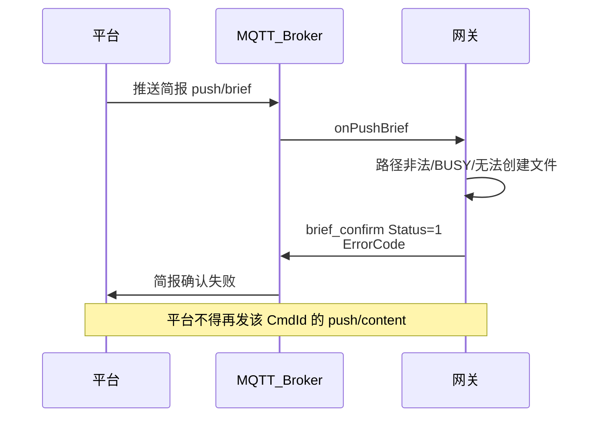
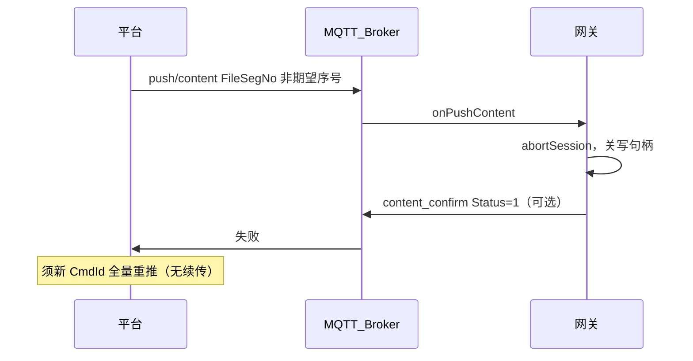

# 18 — 业务时序流程（召唤 / 推送）

**文档版本**：V0.0.4（2026-06-03）

本文档给出**召唤上传**与**平台推送**的 MQTT 交互时序图（含 Topic 与报文阶段）。报文字段详见 [04-通信协议.md](04-通信协议.md)；网关状态机详见 [03-业务流程与状态机.md](03-业务流程与状态机.md)。

默认 `gatewayId=gw001` 时 Topic 前缀为 `transfer/sim/gw001/`。

---

## 1. 召唤文件时序（平台召唤 → 网关上传）

**业务方向**：平台下发召唤，网关从本地读文件，先回**简报**，再按段上传**内容**；V0.0.4 起**每段内容**须收到平台**内容确认**后才发下一段。支持断点续传（`StartByte`，见 [06-断点续传设计.md](06-断点续传设计.md)）。

| 步骤 | 方向 | Topic | 报文 |
|------|------|-------|------|
| ① | 平台 → 网关 | `platform/summon` | 召唤文件 |
| ② | 网关 → 平台 | `gateway/brief` | 文件简报 |
| ③ | 网关 → 平台 | `gateway/content` | 文件内容（分段） |
| ④ | 平台 → 网关 | `platform/content_confirm` | 文件内容确认（V0.0.4） |

### 1.1 正常流程（简报成功 + 逐段确认）

### 1.2 简报失败（R3：不发内容）

### 1.3 内容确认失败或超时（C3 / R4）

### 1.4 断点续传（R5）

中断后平台**再次发布召唤**，相同 `CmdId`（建议）、相同 `FullPathFileName`，`StartByte` 为下一段起始位置（1-based）。网关校验通过后从该偏移继续，**FileSegNo 从 1 重新计数**。

### 1.5 与推送互斥

召唤会话活跃（含 `WaitingContentConfirm`）时，新推送简报返回 `BUSY`；反之推送进行中拒绝新召唤。见 [14-V0.0.3-平台推送.md](14-V0.0.3-平台推送.md) §4。

---

## 2. 推送文件时序（平台推送 → 网关落盘）

**业务方向**：平台将文件写入网关**已知路径**；先**推送简报**，网关**简报确认**成功后再发**推送内容**；网关每收一段即发**内容确认**。不支持断点续传。

| 步骤 | 方向 | Topic | 报文 |
|------|------|-------|------|
| ① | 平台 → 网关 | `platform/push/brief` | 推送文件简报 |
| ② | 网关 → 平台 | `gateway/push/brief_confirm` | 简报确认 |
| ③ | 平台 → 网关 | `platform/push/content` | 推送文件内容（分段） |
| ④ | 网关 → 平台 | `gateway/push/content_confirm` | 推送内容确认 |

### 2.1 正常流程

### 2.2 简报确认失败（P2）

### 2.3 段序号错误或确认失败（P3）

### 2.4 超时（P3 / R4 同类规则）

推送会话在 `timeoutSec`（默认 180s）内若无**有效交互**（收到推送内容段或简报确认后的下一帧交互），网关 `abortSession` 并关闭写句柄。平台需使用**新 CmdId** 重新从简报开始全量推送。

---

## 3. 两业务对比

| 项 | 召唤上传 | 平台推送 |
|----|----------|----------|
| 数据流向 | 网关 → 平台 | 平台 → 网关 |
| 谁先动 | 平台发召唤 | 平台发推送简报 |
| 第一段应答 | 网关简报 | 网关简报确认 |
| 内容段确认方 | **平台**确认网关上传段 | **网关**确认平台推送段 |
| 断点续传 | 支持 `StartByte` | 不支持 |
| 编排模块 | `TransferOrchestrator` | `PushReceiveOrchestrator` |

---

## 4. 修订记录

| 版本 | 日期 | 修订内容 |
|------|------|----------|
| V0.0.4-seq | 2026-06-03 | 初版：召唤（含内容确认、续传）与推送完整时序图 |
