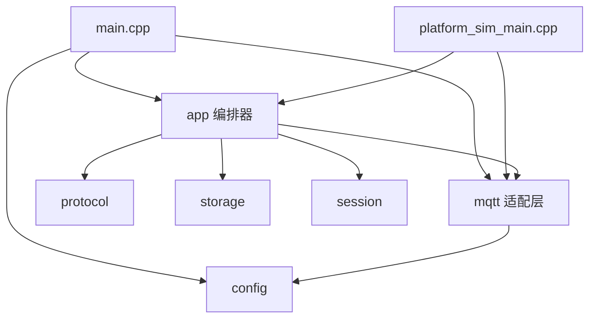
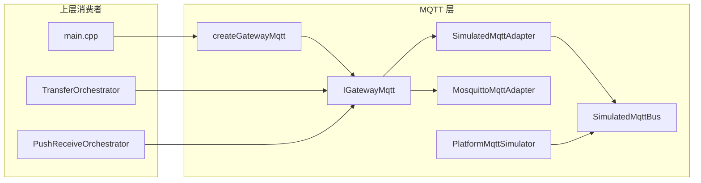

# 19 — 项目目录结构与源码说明

## 1. 文档目的

本文档描述 **transferFile** 仓库的目录布局，并对 `src/` 目录及 **MQTT 层** 做文件级说明，便于新人上手与代码导航。协议字段与状态机细节仍以 [04-通信协议.md](04-通信协议.md)、[05-模块与接口设计.md](05-模块与接口设计.md) 为准。


| 属性     | 值                                      |
| ------ | -------------------------------------- |
| 对应版本   | V0.0.5（CMake `PROJECT_VERSION`）        |
| 头文件根目录 | `include/transfer/`                    |
| 实现根目录  | `src/`                                 |
| 核心静态库  | `transfer_core`（见根目录 `CMakeLists.txt`） |


---

## 2. 项目顶层目录结构

```
transferFile/
├── CMakeLists.txt              # 根构建：transfer_core、transferFile、platform_sim、测试
├── README.md                   # 快速开始
├── .cursorrules                # 项目规则（TDD、交叉编译、验收）
├── compile_commands.json       # clangd 编译数据库（可选）
│
├── cmake/                      # CMake 模块
│   ├── Dependencies.cmake      # 依赖探测（mosquitto、GTest）
│   ├── FindMosquitto.cmake
│   ├── toolchain-openwrt.cmake # OpenWrt aarch64 交叉工具链
│   └── write_build_info.cmake  # 生成 build_info.hpp（版本与编译时间）
│
├── config/                     # 运行时 JSON 配置
│   ├── transferFile.platform.json      # 开发机 platform_sim
│   ├── transferFile.gateway.target.json # 目标机网关
│   ├── transferFile.json / .example
│   └── transferFile.mqtt-debug.json
│
├── include/transfer/           # 公共头文件（与 src 模块对应）
├── src/                        # 实现源码（见第 3 节）
├── tests/                      # TDD 单元/集成测试
│   ├── test_main.cpp
│   ├── minimal_test.hpp        # 无 GTest 时的轻量框架
│   └── unit/                   # 各模块测试用例
│
├── scripts/                    # 构建、打包、验收脚本
│   ├── build-native.sh
│   ├── build-openwrt.sh
│   ├── package-target.sh
│   ├── run-acceptance-tests.sh
│   └── debug-mqtt-local.sh
│
├── document/                   # 设计/验收文档（本目录）
├── third_party/                # mosquitto 源码与 aarch64 预编译库
├── build/                      # 本机编译输出（tests、platform_sim）
├── build-openwrt/              # 交叉编译网关 transferFile
├── dist/                       # 目标机部署包 tar.gz
└── log/                        # 运行日志（按日期）
```

### 2.1 CMake 构建目标


| 目标                   | 源入口                                          | 说明                       |
| -------------------- | -------------------------------------------- | ------------------------ |
| `transfer_core`      | `src/` 下除 `main.cpp`、`platform_sim_main.cpp` | 静态库，业务与 MQTT 实现          |
| `transferFile`       | `src/main.cpp`                               | 网关可执行文件，部署目标机            |
| `platform_sim`       | `src/tools/platform_sim_main.cpp`            | 仅本机非交叉编译 + 已启用 mosquitto |
| `transferFile_tests` | `tests/`                                     | 单元/集成测试可执行文件             |


### 2.2 部署拓扑与目录对应


| 机器  | 程序                                                         | 典型配置                                      |
| --- | ---------------------------------------------------------- | ----------------------------------------- |
| 开发机 | `build/platform_sim`、`mosquitto`                           | `config/transferFile.platform.json`       |
| 目标机 | `build-openwrt/transferFile` 或 `dist/.../bin/transferFile` | `config/transferFile.gateway.target.json` |


---

## 3. `src/` 目录总览

`src/` 按职责分层，与 `include/transfer/` 一一对应，全部编入 `transfer_core`（网关主程序仅额外链接 `main.cpp`）。

```
src/
├── main.cpp                    # 网关入口：配置、MQTT、双编排器、主循环
├── app/                        # 应用编排层
├── mqtt/                       # MQTT 传输层（见第 4 节）
├── protocol/                   # JSON / Base64 / CRC 协议工具
├── storage/                    # 本地文件读写
├── session/                    # 内存会话存储
├── config/                     # 应用与 MQTT 配置加载
└── tools/
    └── platform_sim_main.cpp   # 平台模拟程序入口
```

### 3.1 分层依赖关系




**原则**：`TransferOrchestrator` / `PushReceiveOrchestrator` 只依赖 `IMqttPublisher`、`IPushMqttResponder` 等接口，不直接调用 libmosquitto。

---

## 4. `src/` 文件级说明

### 4.1 `main.cpp` — 网关主程序


| 项        | 说明                                                                                       |
| -------- | ---------------------------------------------------------------------------------------- |
| **职责**   | 加载 `AppConfig`、创建 `IGatewayMqtt`、组装编解码器/存储/会话/看门狗、注册 MQTT 回调、运行主循环                       |
| **命令行**  | `-c/--config` 配置文件；`--simulate` 强制内存总线并跑一轮演示后退出                                          |
| **双编排器** | `TransferOrchestrator`（召唤上传）+ `PushReceiveOrchestrator`（平台推送）                            |
| **互斥**   | `setBusyChecker`：召唤与推送不能同时进行（一方有活跃会话时另一方简报失败）                                            |
| **主循环**  | `mqtt->loop(100)` + `watchdog.tick()` + 10ms sleep；SIGINT/SIGTERM 退出                     |
| **演示模式** | `runSimulateDemo`：写 `/tmp/transfer_demo_file.bin`，`PlatformMqttSimulator` 发召唤并打印收到的简报/内容 |


关键接线（概念上）：

```
setSummonHandler        → orch.onSummon
setContentConfirmHandler → orch.onContentConfirm
setPushBriefHandler     → pushOrch.onPushBrief
setPushContentHandler   → pushOrch.onPushContent
watchdog.setCallback    → orch.onTimeout + pushOrch.onTimeout
```

---

### 4.2 `src/app/` — 应用编排层


| 文件                              | 头文件                             | 职责                                                                                                    |
| ------------------------------- | ------------------------------- | ----------------------------------------------------------------------------------------------------- |
| `transfer_orchestrator.cpp`     | `transfer_orchestrator.hpp`     | **召唤上传（V0.0.4）**：解析召唤 → 路径/CRC 校验 → 发简报 → 逐段发内容 → 等待 `topicContentConfirm` → 续传（`StartByte`）与 180s 超时 |
| `push_receive_orchestrator.cpp` | `push_receive_orchestrator.hpp` | **平台推送（V0.0.3）**：收推送简报 → 简报确认 → 按序收内容写盘 → 逐段内容确认；末段 CRC 校验；**无断点续传**                                  |
| `timeout_watchdog.cpp`          | `timeout_watchdog.hpp`          | 基于单调时钟的会话超时（默认 180s），到期回调 `onTimeout` 中止传输                                                            |
| `runtime_log.cpp`               | `runtime_log.hpp`               | 网关/平台侧结构化日志，按配置落盘到 `log/`                                                                             |
| `mqtt_publisher.cpp`            | `mqtt_publisher.hpp`            | `**RecordingMqttPublisher`**：测试用，记录 `publishBrief` / `publishContent` 顺序与载荷，不连 Broker                 |


编排器依赖的抽象接口：


| 接口                                      | 用途                  |
| --------------------------------------- | ------------------- |
| `IProtocolCodec` / `IPushProtocolCodec` | 召唤 / 推送 JSON 编解码    |
| `IFileStore`                            | 白名单路径下的读（召唤）/ 写（推送） |
| `ISessionStore` / `IPushSessionStore`   | 传输会话状态              |
| `ITimeoutWatchdog`                      | 超时注册与 tick          |
| `IMqttPublisher`                        | 发布简报、内容（召唤方向）       |
| `IPushMqttResponder`                    | 发布推送简报确认、内容确认       |
| `ICrc32Calculator`                      | 文件 CRC32（与协议一致）     |


---

### 4.3 `src/protocol/` — 协议与编码


| 文件                    | 头文件                       | 职责                                                 |
| --------------------- | ------------------------- | -------------------------------------------------- |
| `json_codec.cpp`      | `protocol_codec.hpp`      | `**JsonProtocolCodec**`：召唤、简报、内容段、内容确认的 JSON ↔ DTO |
| `json_push_codec.cpp` | `push_protocol_codec.hpp` | `**JsonPushProtocolCodec**`：推送简报/内容/确认的编解码         |
| `base64.cpp`          | `base64.hpp`              | 内容段 Base64 编解码                                     |
| `crc32.cpp`           | `crc32.hpp`               | `**Crc32Calculator**`：反射多项式 CRC，输出 `0xXXXXXXXX` 格式 |


---

### 4.4 `src/storage/` — 文件存储


| 文件               | 头文件              | 职责                                                                                                               |
| ---------------- | ---------------- | ---------------------------------------------------------------------------------------------------------------- |
| `file_store.cpp` | `file_store.hpp` | `**FileStore**`：实现 `IFileStore`；`allowedPathRoots` 白名单；POSIX `open/read/write`；支持从指定 offset 分段读取（召唤）与创建/追加写入（推送） |


---

### 4.5 `src/session/` — 会话存储


| 文件                              | 头文件                      | 职责                                                                        |
| ------------------------------- | ------------------------ | ------------------------------------------------------------------------- |
| `memory_session_store.cpp`      | `session_store.hpp`      | `**MemorySessionStore**`：召唤上传会话（`cmdId`、偏移、段号、`awaitingConfirmSegNo`、状态等） |
| `memory_push_session_store.cpp` | `push_session_store.hpp` | `**MemoryPushSessionStore**`：推送接收会话（期望段号、目标路径、CRC 等）                      |


均为进程内内存实现，重启不保留状态。

---

### 4.6 `src/config/` — 配置加载


| 文件                  | 头文件                 | 职责                                                     |
| ------------------- | ------------------- | ------------------------------------------------------ |
| `config_loader.cpp` | `config_loader.hpp` | 从 JSON 文件加载 `AppConfig`（MQTT、传输参数、日志、路径白名单等）           |
| `app_config.cpp`    | `app_config.hpp`    | `AppConfig` / `TransferConfig` / `LogConfig` 结构体定义与默认值 |


`AppConfig::mqtt` 类型为 `MqttConfig`，字段说明见 [09-配置文件说明.md](09-配置文件说明.md)。

---

### 4.7 `src/tools/` — 联调工具


| 文件                      | 职责                                                                                                               |
| ----------------------- | ---------------------------------------------------------------------------------------------------------------- |
| `platform_sim_main.cpp` | 开发机 **platform_sim**：连接真实 Broker，向网关发召唤或推送文件；支持 `--gateway-file`、`--start-byte`、`--push-file`、`--gateway-path` 等 |


仅在本机 `build/` 产出，不参与 OpenWrt 交叉编译。

---

## 5. MQTT 层架构概览

MQTT 层位于 `src/mqtt/` + `include/transfer/` 中相关头文件，职责是：

1. **屏蔽** libmosquitto 与内存总线两种实现；
2. **统一** 网关侧订阅（平台 → 网关）与发布（网关 → 平台）的 Topic；
3. 通过 `**IGatewayMqtt`** 向 `main.cpp` 提供回调注册与 `loop()` 驱动。




### 5.1 Topic 与数据方向（默认命名）

前缀：`transfer/sim/{gatewayId}/`（由 `makeDefaultMqttConfig` 生成，可在 JSON 中覆盖）。


| 业务   | 方向      | 配置字段                      | 默认后缀                           | 网关动作                                 |
| ---- | ------- | ------------------------- | ------------------------------ | ------------------------------------ |
| 召唤上传 | 平台 → 网关 | `topicSummon`             | `platform/summon`              | **订阅**，回调 `onSummon`                 |
| 召唤上传 | 网关 → 平台 | `topicBrief`              | `gateway/brief`                | **发布** 简报                            |
| 召唤上传 | 网关 → 平台 | `topicContent`            | `gateway/content`              | **发布** 内容段                           |
| 召唤上传 | 平台 → 网关 | `topicContentConfirm`     | `platform/content_confirm`     | **订阅**，回调 `onContentConfirm`（V0.0.4） |
| 平台推送 | 平台 → 网关 | `topicPushBrief`          | `platform/push/brief`          | **订阅**，回调 `onPushBrief`              |
| 平台推送 | 网关 → 平台 | `topicPushBriefConfirm`   | `gateway/push/brief_confirm`   | **发布** 推送简报确认                        |
| 平台推送 | 平台 → 网关 | `topicPushContent`        | `platform/push/content`        | **订阅**，回调 `onPushContent`            |
| 平台推送 | 网关 → 平台 | `topicPushContentConfirm` | `gateway/push/content_confirm` | **发布** 推送内容确认                        |


---

## 6. MQTT 层文件级说明

### 6.1 接口与配置头文件（`include/transfer/`）


| 头文件                              | 说明                                                                                                           |
| -------------------------------- | ------------------------------------------------------------------------------------------------------------ |
| `**mqtt_config.hpp`**            | `MqttConfig` 结构体：Broker 地址、clientId、gatewayId、全部 Topic 字符串、`useSimulatedBus`、QoS、keepAlive、用户名密码             |
| `**mqtt_publisher.hpp**`         | `IMqttPublisher`：召唤方向 `publishBrief` / `publishContent`；测试用 `RecordingMqttPublisher`                         |
| `**push_mqtt_responder.hpp**`    | `IPushMqttResponder`：推送方向 `publishPushBriefConfirm` / `publishPushContentConfirm`                            |
| `**gateway_mqtt.hpp**`           | `IGatewayMqtt`：合并上述两个接口 + 四类 `set*Handler` + `start/stop/loop`；声明 `createGatewayMqtt`、`isMosquittoSupported` |
| `**simulated_mqtt_bus.hpp**`     | 内存总线：`subscribe` / `unsubscribe` / `publish`（同步分发）+ `history()`                                              |
| `**mqtt_adapter.hpp**`           | `SimulatedMqttAdapter`（实现 `IGatewayMqtt`）、`PlatformMqttSimulator`（测试/演示用平台侧）                                 |
| `**mosquitto_mqtt_adapter.hpp**` | `MosquittoMqttAdapter`：libmosquitto 实现；`dispatch*` 供回调线程调用                                                   |


### 6.2 实现文件（`src/mqtt/`）

#### `mqtt_config.cpp`


| 函数                                 | 行为                                               |
| ---------------------------------- | ------------------------------------------------ |
| `makeDefaultMqttConfig(gatewayId)` | 填充 `transfer/sim/{id}/...` 系列 Topic 与 `clientId` |


生产环境 Topic 占位名可在 JSON 配置中整体替换，无需改代码。

---

#### `simulated_mqtt_bus.cpp`


| 项                 | 说明                                                     |
| ----------------- | ------------------------------------------------------ |
| **类**             | `SimulatedMqttBus`                                     |
| **线程安全**          | `mutex_` 保护订阅表与历史                                      |
| `**subscribe`**   | 同一 Topic 可注册多个 handler（vector）                         |
| `**publish**`     | 先记入 `history_`，再**同步**调用该 Topic 所有 handler（用于单测确定性）    |
| `**unsubscribe`** | 删除 Topic 下全部 handler（`SimulatedMqttAdapter::stop` 使用）  |
| **使用场景**          | `useSimulatedBus=true`、`--simulate`、不启 mosquitto 的单元测试 |


---

#### `mqtt_adapter.cpp`

包含 `**SimulatedMqttAdapter`** 与 `**PlatformMqttSimulator**`。

`**SimulatedMqttAdapter**`


| 方法                         | 行为                                                                                      |
| -------------------------- | --------------------------------------------------------------------------------------- |
| `start`                    | 订阅 4 个入站 Topic（summon、push brief/content、content_confirm），将 payload 转发给对应 `on*` handler |
| `stop`                     | `unsubscribe` 上述 Topic                                                                  |
| `loop`                     | 空操作，返回 0（无网络线程）                                                                         |
| `publishBrief/Content/...` | `bus_.publish` 到对应出站 Topic                                                              |


`**PlatformMqttSimulator**`（非 `IGatewayMqtt`，仅供演示/测试）


| 方法                                    | 行为                                                                                                               |
| ------------------------------------- | ---------------------------------------------------------------------------------------------------------------- |
| 构造                                    | 订阅 `topicBrief`、`topicContent`，收集到 `received`_                                                                   |
| 构造时逻辑                                 | 收到 **content** 后，从 JSON 提取 `CmdId`/`FileSegNo`，自动生成 `Status=0` 的 **content_confirm** 并 `publish`（模拟 V0.0.4 平台确认） |
| `publishSummon/PushBrief/PushContent` | 模拟平台向网关下发                                                                                                        |
| `subscribePushConfirms`               | 额外订阅推送确认 Topic，用于推送 E2E 测试                                                                                       |


---

#### `mosquitto_mqtt_adapter.cpp`


| 项               | 说明                                                                     |
| --------------- | ---------------------------------------------------------------------- |
| **编译开关**        | 定义 `TRANSFER_WITH_MOSQUITTO` 时链接 libmosquitto；否则为空桩，`start` 返回“未编译”错误  |
| `**start`**     | `mosquitto_lib_init` → `mosquitto_new` → 可选用户名密码 → `mosquitto_connect` |
| `**onConnect**` | 连接成功后订阅 4 个入站 Topic（QoS 来自配置）                                          |
| `**onMessage**` | 按 Topic 字符串匹配，调用 `dispatchSummon` 等                                    |
| `**dispatch***` | `handlerMutex_` 保护，调用编排器注册的 `std::function`                            |
| `**loop**`      | `mosquitto_loop(mosq_, timeoutMs, 1)`，由 `main` 每轮调用                    |
| `**publish***`  | 统一 `publishTopic` → `mosquitto_publish`                                |
| `**stop**`      | disconnect、destroy、cleanup                                             |


目标机部署需 `LD_LIBRARY_PATH` 指向打包的 `libmosquitto.so`（见 `dist/` 与 [07-构建与交叉编译.md](07-构建与交叉编译.md)）。

---

#### `gateway_mqtt_factory.cpp`


| 函数                                            | 逻辑                                                                                                                              |
| --------------------------------------------- | ------------------------------------------------------------------------------------------------------------------------------- |
| `isMosquittoSupported()`                      | 是否编译了 `TRANSFER_WITH_MOSQUITTO`                                                                                                 |
| `createGatewayMqtt(bus, config, errorDetail)` | `useSimulatedBus==true` → `SimulatedMqttAdapter(*bus)`，**要求** `bus!=nullptr`；否则 → `MosquittoMqttAdapter`，若未编译 mosquitto 则返回错误提示 |


`main.cpp` 调用示例：

```cpp
SimulatedMqttBus bus;
auto mqtt = createGatewayMqtt(
    app.mqtt.useSimulatedBus ? &bus : nullptr,
    app.mqtt, mqttCreateErr);
```

---

#### `src/app/mqtt_publisher.cpp`


| 类                        | 说明                                                                                     |
| ------------------------ | -------------------------------------------------------------------------------------- |
| `RecordingMqttPublisher` | 实现 `IMqttPublisher`，将每次发布存入 `messages_` 向量；**不经过** `IGatewayMqtt`，用于编排器单测（注入 mock 发布器） |


---

### 6.3 `IGatewayMqtt` 与编排器的衔接

`IGatewayMqtt` 继承关系：

```
IGatewayMqtt
├── IMqttPublisher      → TransferOrchestrator 使用
└── IPushMqttResponder  → PushReceiveOrchestrator 使用
```

`main.cpp` 将同一 `IGatewayMqtt` 实例同时传给两个编排器（引用 `*mqtt`），保证发布/订阅 Topic 一致。


| 回调注册                       | 触发来源 Topic            | 处理函数                                     |
| -------------------------- | --------------------- | ---------------------------------------- |
| `setSummonHandler`         | `topicSummon`         | `TransferOrchestrator::onSummon`         |
| `setContentConfirmHandler` | `topicContentConfirm` | `TransferOrchestrator::onContentConfirm` |
| `setPushBriefHandler`      | `topicPushBrief`      | `PushReceiveOrchestrator::onPushBrief`   |
| `setPushContentHandler`    | `topicPushContent`    | `PushReceiveOrchestrator::onPushContent` |


---

### 6.4 两种运行模式对比


| 模式        | 配置                                       | 实现类                    | `loop`           | 典型场景                   |
| --------- | ---------------------------------------- | ---------------------- | ---------------- | ---------------------- |
| 模拟总线      | `useSimulatedBus: true` 或 `--simulate`   | `SimulatedMqttAdapter` | 无网络，立即返回         | 单元测试、`main --simulate` |
| 真实 Broker | `useSimulatedBus: false` + 已编译 mosquitto | `MosquittoMqttAdapter` | `mosquitto_loop` | 本机联调、目标机生产             |


---

## 7. `include/transfer/` 与 `src/` 对照表


| 头文件                             | 实现文件                                    | 模块                           |
| ------------------------------- | --------------------------------------- | ---------------------------- |
| `types.hpp`                     | —                                       | 领域 DTO、枚举                    |
| `error_codes.hpp`               | —                                       | 错误码常量                        |
| `version.hpp`                   | —                                       | 版本字符串（与 `build_info.hpp` 配合） |
| `protocol_codec.hpp`            | `protocol/json_codec.cpp`               | 召唤协议                         |
| `push_protocol_codec.hpp`       | `protocol/json_push_codec.cpp`          | 推送协议                         |
| `base64.hpp`                    | `protocol/base64.cpp`                   | Base64                       |
| `crc32.hpp`                     | `protocol/crc32.cpp`                    | CRC32                        |
| `file_store.hpp`                | `storage/file_store.cpp`                | 文件 IO                        |
| `session_store.hpp`             | `session/memory_session_store.cpp`      | 召唤会话                         |
| `push_session_store.hpp`        | `session/memory_push_session_store.cpp` | 推送会话                         |
| `timeout_watchdog.hpp`          | `app/timeout_watchdog.cpp`              | 超时                           |
| `runtime_log.hpp`               | `app/runtime_log.cpp`                   | 日志                           |
| `transfer_orchestrator.hpp`     | `app/transfer_orchestrator.cpp`         | 召唤编排                         |
| `push_receive_orchestrator.hpp` | `app/push_receive_orchestrator.cpp`     | 推送编排                         |
| `mqtt_publisher.hpp`            | `app/mqtt_publisher.cpp`                | 测试发布记录                       |
| `mqtt_config.hpp`               | `mqtt/mqtt_config.cpp`                  | MQTT 配置                      |
| `simulated_mqtt_bus.hpp`        | `mqtt/simulated_mqtt_bus.cpp`           | 内存总线                         |
| `mqtt_adapter.hpp`              | `mqtt/mqtt_adapter.cpp`                 | 模拟适配器 + 平台模拟器                |
| `mosquitto_mqtt_adapter.hpp`    | `mqtt/mosquitto_mqtt_adapter.cpp`       | 真实 MQTT                      |
| `gateway_mqtt.hpp`              | `mqtt/gateway_mqtt_factory.cpp`         | 工厂                           |
| `config_loader.hpp`             | `config/config_loader.cpp`              | 配置加载                         |
| `app_config.hpp`                | `config/app_config.cpp`                 | 应用配置结构                       |


---

## 8. 测试目录与 MQTT 相关用例


| 测试文件                       | 覆盖点                                                               |
| -------------------------- | ----------------------------------------------------------------- |
| `test_mqtt_simulation.cpp` | `SimulatedMqttBus`、`SimulatedMqttAdapter`、`PlatformMqttSimulator` |
| `test_orchestrator*.cpp`   | 召唤编排 + `RecordingMqttPublisher` / 模拟总线                            |
| `test_push_*.cpp`          | 推送编排 + MQTT 应答                                                    |
| `test_push_e2e.cpp`        | 推送端到端（含确认 Topic）                                                  |


运行全部验收：`./scripts/run-acceptance-tests.sh`（47 项）。

---

## 9. 相关文档


| 文档                               | 内容                   |
| -------------------------------- | -------------------- |
| [02-系统架构.md](02-系统架构.md)         | 模块划分与部署视图            |
| [05-模块与接口设计.md](05-模块与接口设计.md)   | DTO、接口方法清单           |
| [09-配置文件说明.md](09-配置文件说明.md)     | `MqttConfig` JSON 字段 |
| [10-MQTT本机联调.md](10-MQTT本机联调.md) | Broker + 双机联调步骤      |
| [18-业务时序流程.md](18-业务时序流程.md)     | 召唤/推送 MQTT 时序图       |


---

## 10. 修订记录


| 日期         | 说明                           |
| ---------- | ---------------------------- |
| 2026-06-04 | 初版：项目目录、`src/` 与 MQTT 层文件级说明 |


