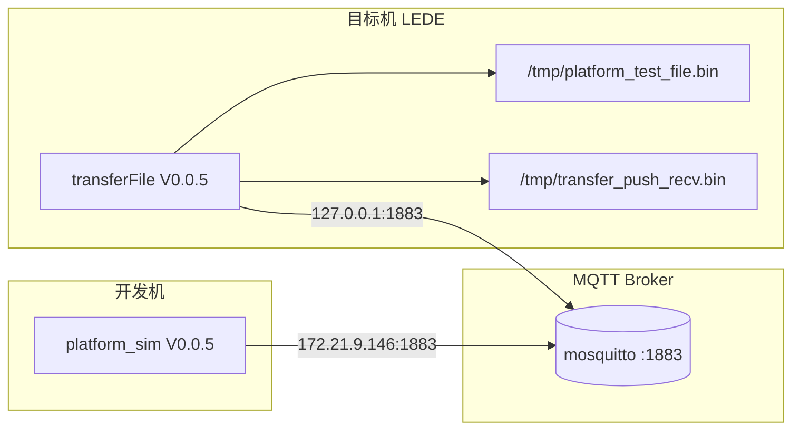

# 20 — 双机联调结果报告

## 1. 概述

| 项 | 内容 |
|----|------|
| 联调日期 | **2026-06-05** |
| 联调结论 | **通过** — 召唤上传、平台推送两条业务链路均一次成功 |
| 软件版本 | 网关 `transferFile` **V0.0.5**；平台 `platform_sim` **V0.0.5** |
| 协议能力 | V0.0.4 召唤**逐段内容确认** + V0.0.3 平台**推送简报/内容确认** |
| 关联文档 | [10-MQTT本机联调.md](10-MQTT本机联调.md)、[17-V0.0.4-验收说明.md](17-V0.0.4-验收说明.md)、[15-V0.0.3-验收说明.md](15-V0.0.3-验收说明.md)、[18-业务时序流程.md](18-业务时序流程.md) |

本次联调在**开发机**运行 `platform_sim` 模拟平台，在**目标机（LEDE / OpenWrt）**运行交叉编译产物 `transferFile` 网关，经 MQTT 完成双向文件传输验证。

## 2. 部署拓扑



| 角色 | 主机 | 程序 | Broker 地址 | gatewayId |
|------|------|------|-------------|-----------|
| 平台模拟 | 开发机 | `platform_sim` | `172.21.9.146:1883` | `gw001` |
| 网关 | 目标机 | `transferFile` | `127.0.0.1:1883` | `gw001` |

**说明**：目标机网关配置 `config/transferFile.gateway.target.json` 中 `brokerHost` 为 `127.0.0.1`，表示 Broker 在目标机本机监听；开发机平台通过目标机局域网 IP `172.21.9.146` 接入同一 Broker。`gatewayId` 两边均为 `gw001`，Topic 前缀为 `transfer/sim/gw001/`。

### 2.1 网关启动信息（目标机）

```
transferFile V0.0.5
编译  2026-06-04 16:29:09.921
配置  config/transferFile.gateway.target.json
传输  180s · 4096B    路径  /tmp/, /data/transfer/
MQTT  127.0.0.1:1883 · gw001 · mosquitto
就绪  召唤上传 + 平台推送 (Ctrl+C 退出)
```

### 2.2 平台启动信息（开发机）

```
platform_sim (平台模拟) V0.0.5
编译  2026-06-04 14:37:43.605
Broker  172.21.9.146:1883
```

## 3. 联调用例与结果

### 3.1 用例 A — 召唤上传（平台 → 网关读文件 → 平台收文件）

| 项 | 值 |
|----|-----|
| CmdId | `8001` |
| 目标机源文件 | `/tmp/platform_test_file.bin` |
| StartByte | `1`（从头传输） |
| 平台落盘 | `/tmp/platform_received_file.bin` |
| 结果 | **成功** |

**开发机命令**：

```bash
./build/platform_sim -c config/transferFile.platform.json \
  --gateway-file /tmp/platform_test_file.bin
```

**目标机命令**（联调前已启动并保持运行）：

```bash
./bin/transferFile -c config/transferFile.gateway.target.json
```

#### 3.1.1 时序与关键报文

| 顺序 | 方向 | Topic 后缀 | 要点 |
|------|------|------------|------|
| 1 | 平台 → 网关 | `platform/summon` | `FullPathFileName=/tmp/platform_test_file.bin`，`StartByte=1` |
| 2 | 网关 → 平台 | `gateway/brief` | `Status=0`，`FileSize=5`，`FileCrc=0x3BB935C6` |
| 3 | 网关 → 平台 | `gateway/content` | `FileSegNo=1`，`Content=dGVzdAo=`，`Continue=0` |
| 4 | 平台 → 网关 | `platform/content_confirm` | `FileSegNo=1`，`Status=0` |
| 5 | — | — | 网关：`传输完成`；平台：`5 bytes saved`，`联调成功` |

**简报 JSON（网关发布）**：

```json
{"Data":{"CmdId":"8001","Status":"0","ErrorCode":"","Note":"","FileCrc":"0x3BB935C6","FileSize":"5","ModifyTime":"2026-06-01 16:19:32"}}
```

**内容段 JSON（网关发布）**：

```json
{"Data":{"CmdId":"8001","FileSegNo":"1","Content":"dGVzdAo=","Continue":"0"}}
```

**内容确认 JSON（平台发布）**：

```json
{"Data":{"CmdId":"8001","FileSegNo":"1","Status":"0","ErrorCode":"","Note":""}}
```

#### 3.1.2 验收对照（V0.0.4 C1～C2）

| 验收点 | 现象 | 判定 |
|--------|------|------|
| C1 平台每段后发内容确认 | 平台日志 `<<< 已发布内容确认`，SegNo=1 | 通过 |
| C2 网关收到确认后完成传输 | 网关 `<<< 收到文件内容确认` → `内容确认成功` → `传输完成` | 通过 |
| 文件一致性 | 5 字节；Base64 `dGVzdAo=` 解码为 `test\n` | 通过 |

---

### 3.2 用例 B — 平台推送（平台 → 网关写文件）

| 项 | 值 |
|----|-----|
| CmdId | `9001` |
| 网关落盘路径 | `/tmp/transfer_push_recv.bin` |
| 文件大小 | 6 字节 |
| 文件 CRC | `0xBB76FE69` |
| 结果 | **成功** |

**开发机命令**：

```bash
./build/platform_sim -c config/transferFile.platform.json \
  --push-file /tmp/transfer_push_recv.bin \
  --gateway-path /tmp/transfer_push_recv.bin
```

#### 3.2.1 时序与关键报文

| 顺序 | 方向 | Topic 后缀 | 要点 |
|------|------|------------|------|
| 1 | 平台 → 网关 | `platform/push/brief` | `FileSize=6`，`FileCrc=0xBB76FE69` |
| 2 | 网关 → 平台 | `gateway/push/brief_confirm` | `Status=0` |
| 3 | 平台 → 网关 | `platform/push/content` | `SegNo=1`（最后一段） |
| 4 | 网关 → 平台 | `gateway/push/content_confirm` | `FileSegNo=1`，`Status=0` |
| 5 | — | — | 平台：`Push complete: 6 bytes`；网关：`推送文件接收完成` |

**推送简报 JSON（平台发布）**：

```json
{"Data":{"CmdId":"9001","FullPathFileName":"/tmp/transfer_push_recv.bin","FileCrc":"0xBB76FE69","FileSize":"6","ModifyTime":"2026-06-03 12:00:00"}}
```

**简报确认 JSON（网关发布）**：

```json
{"Data":{"CmdId":"9001","Status":"0","ErrorCode":"","Note":""}}
```

**内容确认 JSON（网关发布）**：

```json
{"Data":{"CmdId":"9001","FileSegNo":"1","Status":"0","ErrorCode":"","Note":""}}
```

#### 3.2.2 验收对照（V0.0.3 P1～P3）

| 验收点 | 现象 | 判定 |
|--------|------|------|
| P1 路径在 allowedPathRoots 内 | `/tmp/transfer_push_recv.bin` 属于 `/tmp/` | 通过 |
| P2 简报确认成功后再发内容 | 网关 `推送简报确认成功，等待文件内容...` 后收内容 | 通过 |
| P3 每段内容后网关确认 | `已发布推送内容确认 CmdId=9001 SegNo=1 成功` | 通过 |

## 4. 日志摘录

> 开发机与目标机系统时钟存在约 **50 秒** 偏差，以下按**事件顺序**排列，时间戳仅作参考。

### 4.1 目标机网关日志

```
[2026-06-05 09:49:04.046] MQTT 已连接，已订阅Topic：召唤/推送/内容确认
[2026-06-05 09:50:50.573] <<< 收到召唤报文 CmdId=8001 文件=/tmp/platform_test_file.bin StartByte=1
[2026-06-05 09:50:50.576] >>> 已发布简报成功 FileSize=5 FileCrc=0x3BB935C6
[2026-06-05 09:50:50.577] >>> 已发布内容段 SegNo=1 字节=5 Continue=0
[2026-06-05 09:50:50.657] <<< 收到文件内容确认 SegNo=1 Status=0
[2026-06-05 09:50:50.658] 传输完成 CmdId=8001 总大小=5 字节
[2026-06-05 09:53:51.227] <<< 收到推送文件简报 CmdId=9001 路径=/tmp/transfer_push_recv.bin FileSize=6
[2026-06-05 09:53:51.228] >>> 已发布推送简报确认 成功
[2026-06-05 09:53:51.349] >>> 已发布推送内容确认 SegNo=1 成功
[2026-06-05 09:53:51.349] 推送文件接收完成 大小=6
```

### 4.2 开发机平台日志（摘要）

**召唤上传**（约 09:50:00）：

- `>>> 已发布召唤` → 收到简报 → 收到内容 → `<<< 已发布内容确认`
- `文件接收完成: 5 bytes saved -> /tmp/platform_received_file.bin`
- `联调成功：平台发召唤，目标机网关已回传文件`

**平台推送**（约 09:53:01）：

- `>>> 已发布推送简报` → 收到 `brief_confirm Status=0` → 发送内容 SegNo=1
- 收到 `content_confirm Status=0`
- `Push complete: 6 bytes -> Gateway path /tmp/transfer_push_recv.bin`
- `联调成功：平台已向目标机网关推送文件`

## 5. 结论与建议

### 5.1 结论

| 业务 | 版本需求 | 联调结果 |
|------|----------|----------|
| 召唤上传 + 平台内容确认 | V0.0.4（C1～C2） | **通过** |
| 平台推送至网关 | V0.0.3（P1～P3） | **通过** |
| 双 Topic 族并行 | 同一网关进程同时订阅召唤与推送 | **通过** |

在目标机 OpenWrt 环境下，`transferFile V0.0.5` 与 `platform_sim V0.0.5` 的 MQTT 报文格式、Topic 路由、逐段确认时序与文档 [04-通信协议.md](04-通信协议.md)、[18-业务时序流程.md](18-业务时序流程.md) 一致。

### 5.2 后续建议（未在本次联调覆盖）

| 项 | 说明 |
|----|------|
| 断点续传 R5 | 使用 `--start-byte` 与 `cmp` 做目标机手工续传验收（见 [12-V0.0.2-验收说明.md](12-V0.0.2-验收说明.md)） |
| 多段大文件 | 单段 5/6 字节已验证流程；建议补充 >4096B 多段 `Continue=1` 联调 |
| 失败路径 | 简报失败、内容确认 `Status=1`、180s 超时中止 |
| 生产对接 | Topic / ErrorCode 定稿、TLS 与鉴权（见 [13-项目状态与路线图.md](13-项目状态与路线图.md) P0） |
| 时钟同步 | 建议目标机配置 NTP，便于双机日志对齐排查 |

## 6. 修订记录

| 版本 | 日期 | 修订内容 |
|------|------|----------|
| 20-joint-1 | 2026-06-05 | 初版：2026-06-05 开发机 + LEDE 目标机双机联调通过记录 |
